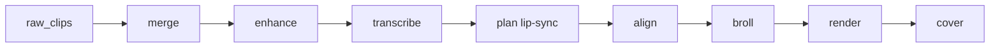

# ReelKut — Team Overview

Video-first pipeline: upload talking-head clips → enhance → transcribe → lip-sync-safe edit plan → B-roll → vertical Reel + optional cover.

**Product UI:** Vite landing + studio (`frontend/`) talking to FastAPI (`api/`) with multi-user JWT auth.

## What it produces

- Cleaned transcript + edit plan: `raw_script.md`, `final_script.json` (same spoken words)
- Final video: `final/reel.mp4`
- Cover: `final/cover.jpg`
- Observability: `project.json`, `run_report.json`

## Default flow (video_first)

CLI: `python pipeline.py <name> --mode video_first`  
API: `uvicorn api.main:app --port 8000`  
UI: `cd frontend && npm run dev` → http://127.0.0.1:5173  

See [PRODUCT.md](PRODUCT.md) and [README.md](README.md).

## Where to look

| Area | Path |
|------|------|
| Orchestrator | `pipeline.py` |
| API + auth | `api/main.py`, `core/auth.py`, `core/project_store.py` |
| Jobs | `jobs/` |
| Contracts | `schemas/` |
| Plan from transcript | `script_engine/plan_from_transcript.py` |
| Lip-sync guard | `script_engine/lip_sync.py` |
| Editor pacing | `script_engine/editor_agent.py` |
| Veo B-roll | `video_engine/veo_client.py`, `video_engine/broll.py` |
| Enhance / render | `video_engine/enhance.py`, `video_engine/render.py` |
| Landing + studio | `frontend/src/Landing.tsx`, `App.tsx` |

## Config knobs

- `AUTH_MODE=dev` (local) / `clerk` (public)
- `BROLL_VEO_ONLY=1`, `VEO_MODEL=veo-3.1-lite-generate-preview`, `VEO_MAX_CLIPS=5`
- `AUDIO_PRESET=social`
- `RATE_LIMIT_*` for shared-key safety
