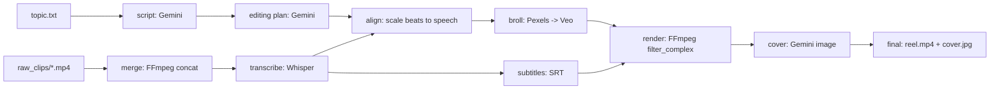

# AI Reel Factory — Team Overview

This project converts a topic + recorded talking-head clips into a vertically edited Instagram Reel using a local, stage-based pipeline.

## What it produces

- **Script + edit plan**: `projects/<name>/raw_script.md`, `projects/<name>/final_script.json`
- **Final video**: `projects/<name>/final/reel.mp4`
- **Reel cover (optional stage)**: `projects/<name>/final/cover.jpg` — AI-generated from A-roll frames + script; see `README.md` (Cover stage).
- Intermediate artifacts: merged video, transcript JSON, edit timeline JSON, B-roll clips, subtitles.

## High-level pipeline

The entrypoint is `pipeline.py`, which runs stages in order (you can run a subset with `--from` / `--to`).



### Stages (practical meaning)

- **`script`**: Uses Gemini to generate a Reel-ready script (`raw_script.md`) and an editing plan (`final_script.json`) with alternating A-roll/B-roll beats.
- **`merge`**: Concatenates `raw_clips/01.mp4`, `02.mp4`, ... into `merged/merged.mp4`.
- **`transcribe`**: Runs Whisper to produce `transcripts/transcript.json` (used for timing + subtitles).
- **`align`**: Scales the beat timing from `final_script.json` to the real audio duration based on the transcript, and writes `cuts/timeline.json`.
  - B-roll segments are capped by `MAX_BROLL_SECONDS` (default 5).
- **`broll`**: For each B-roll segment in `cuts/timeline.json`, sources a clip into `projects/<name>/broll/`:
  1) reuse existing `broll/00X.mp4` if present  
  2) try Pexels (free)  
  3) fall back to Veo (paid) if enabled
- **`subtitles`**: Generates `subtitles/captions.srt` from the transcript.
- **`render`**: Builds the final Reel with FFmpeg:
  - 1.2× speed
  - white flash at start
  - alternating zoom cuts on A-roll
  - B-roll overlays with fades
  - speaker audio gain (default +2.5 dB)
  - output to `final/reel.mp4`
- **`cover`** (after render): Extracts frames from `final/reel.mp4`, calls Gemini image models with script + optional repo-root style references; writes `final/cover.jpg` and `cover/` artifacts. See `README.md`.

## Key design choices

- **A-roll first hook**: The first beat is always the speaker to anchor attention.
- **B-roll overlay (not concat)**: B-roll is visually overlaid so the original speaking audio timeline stays continuous.
- **Prompt-driven visuals**:
  - Gemini creates the editing plan + per-beat B-roll “suggestions”.
  - Veo sees per-clip prompts (not the whole script); script-level meaning is “baked into” the suggestions.

## Where to look in code

- `pipeline.py`: orchestrates stages.
- `script_engine/`:
  - `generate_script.py`: Gemini prompt → script
  - `editing_plan.py`: script → JSON beats (A-roll/B-roll)
  - `llm.py`: reference + style guide injection into prompts
- `prompts/`:
  - `script_generation.txt`: script prompt template
  - `editing_plan.txt`: edit-plan prompt template
- `references/`: hook patterns / writing styles / visual patterns (injected into prompts).
- `video_engine/`:
  - `merge_clips.py`: concat
  - `transcribe.py`: Whisper
  - `timeline.py`: scale beats to transcript; cap B-roll duration
  - `broll.py`: Pexels-first, Veo fallback (or Veo-only)
  - `veo_client.py`: builds Veo prompt strings; optional prompt logging
  - `subtitles.py`: SRT generation
  - `render.py`: FFmpeg render graph
  - `cover.py`: AI Instagram reel cover (A-roll identity + optional global style refs)

## Configuration knobs (common)

### Keys

- `GOOGLE_API_KEY`: required (Gemini + Veo)
- `PEXELS_API_KEY`: optional but recommended (free stock B-roll)

### B-roll sourcing

- `BROLL_VEO_ONLY=1`: skip Pexels; generate all B-roll via Veo
- `BROLL_USE_VEO=0`: disable Veo fallback (Pexels only)
- `VEO_MODEL`: choose Veo model
- `VEO_KINETIC_IG=1`: more kinetic, high-energy Veo prompting
- `VEO_EXPAND_PROMPT=1`: Gemini expands each B-roll suggestion into a Veo-optimized prompt (extra Gemini call per Veo clip)

### Debugging prompts

- `VEO_LOG_PROMPTS=1`: prints and appends prompts to `projects/<name>/broll/veo_prompts.log`
- `VEO_PROMPT_LOG=...`: custom log file path

### Render tuning

- `SPEAKER_VOLUME_DB`: speaker gain after speed-up (default 2.5)
- `MAX_BROLL_SECONDS`: maximum on-screen time per B-roll segment (default 5)

## Typical usage commands

Full step-by-step (setup → script → record → video → optional cover): see **[PYTHON_COMMANDS.md](PYTHON_COMMANDS.md)** in the repo root.

From repo root, common shortcuts:

```powershell
cd "c:\Work documents\ai_reel_factory"

# New reel: script + plan only
python .\pipeline.py project_001 --from script --to script

# After raw_clips/ exist: merge through rendered video (no cover)
python .\pipeline.py project_001 --from merge --to render

# Optional: AI Instagram cover (needs final/reel.mp4 + raw_script.md)
python .\pipeline.py project_001 --from cover --to cover

# Full pipeline including cover in one range (after topic + clips exist)
python .\pipeline.py project_001 --from script --to cover

# Force Veo-only B-roll (delete old clips first to regenerate)
Remove-Item -ErrorAction Ignore ".\projects\project_001\broll\*.mp4"
$env:BROLL_VEO_ONLY="1"
python .\pipeline.py project_001 --from broll --to broll
```

